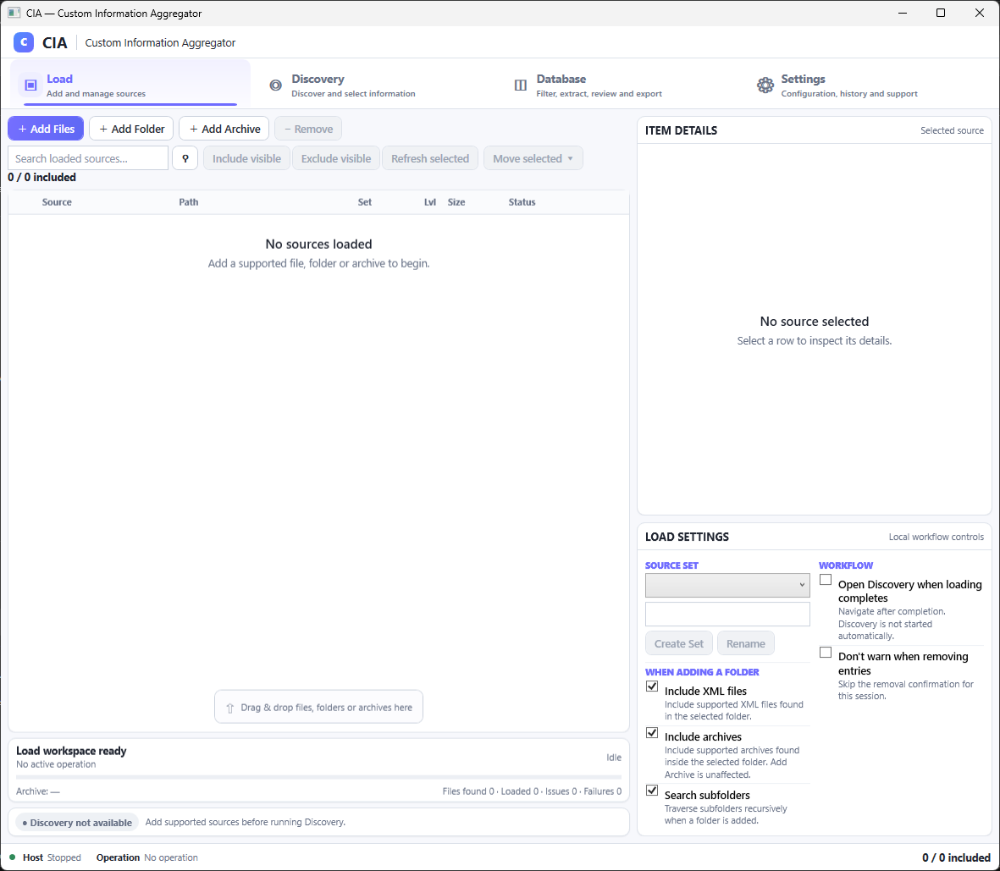

# Custom Information Aggregator

A Windows desktop application for turning large XML document sets into structured, reviewable and exportable information.

<!-- APPLICATION SCREENSHOT
Add the recruiter-facing screenshot as:

docs/assets/cia-overview.png

Then replace this comment block with:

-->

## What is this?

Custom Information Aggregator started as a practical response to a real Maintenance, Repair and Overhaul (MRO) problem: useful information can be buried inside thousands of structured technical documents, while extracting it manually is slow, repetitive and difficult to scale.

An earlier working prototype proved that a large part of that work could be automated. This repository is a ground-up rebuild of that idea as a configurable desktop application, with the emphasis shifted from a one-off automation script to a maintainable product with a clear workflow, formal requirements, architecture, automated verification and release planning.

The application is designed to let a user load large XML document sets, discover the information structures inside them, choose what matters, build a reviewable database and export the resulting information to Excel without manually searching through the source files.

## Basic workflow

1. **Load** files, folders or archives into the application.
2. **Discover** the XML information available across the loaded sources.
3. **Select** the information to keep, rename it where useful, and exclude unwanted data.
4. **Build the Database** from the selected information.
5. **Review** the resulting data and configure how it should be presented.
6. **Prepare and export** the required fields to Excel.

The workflow is still being refined during Alpha development, so individual controls and presentation details may change before release.

## Development status

**Current stage: Alpha development**

- ✅ Application foundation, desktop workspace and processing architecture
- ✅ File, folder and archive loading with active source management
- ✅ Generic XML discovery, structural context and field selection
- ✅ Database generation and review workflow
- ✅ Extraction pipeline and configurable Excel export engine
- 🟡 End-to-end UI/UX completion and workflow refinement
- 🟡 Release validation, defect correction and packaging

### Release roadmap

| Milestone | Target | Goal |
|---|---:|---|
| **Full Alpha** | **11 September 2026** | Complete end-to-end application workflow available for Alpha testing |
| **Release Candidate** | **18 September 2026** | Feature-complete build focused on verification, defects and release readiness |
| **First Release** | After RC acceptance | Packaged release following successful Release Candidate validation |

Dates are current project targets and may move if release-blocking defects are found during validation.

## For technical reviewers

The project is being developed as a full software-engineering lifecycle rather than only as a coding exercise. The current implementation uses **C# / .NET 10 / WPF**, with a separate desktop UI and processing host communicating through typed named-pipe IPC. Data-processing workflows use bounded/streaming approaches, SQLite-backed intermediate results and native `.xlsx` generation without requiring Microsoft Excel.

The repository also contains controlled requirements, architecture and delivery-planning baselines, with implementation work developed through short-lived branches and pull requests and supported by an automated test suite.

### Project baselines

- [STEP-001 — Project Initiation](docs/initiation/STEP-001-project-initiation-baseline.md)
- [STEP-002 — User Requirements](docs/requirements/STEP-002-requirements-baseline.md)
- [STEP-003 — System / Software Requirements Specification](docs/srs/STEP-003-srs-baseline.md)
- [STEP-004 — Architecture & Solution Design](docs/architecture/STEP-004-architecture-baseline.md)
- [STEP-005 — Delivery Planning / Backlog Decomposition](docs/delivery/STEP-005-delivery-plan-baseline.md)

Detailed controlled requirements, architecture decisions and traceability are maintained in Confluence; Jira is used to track SDLC execution and sprint work.
